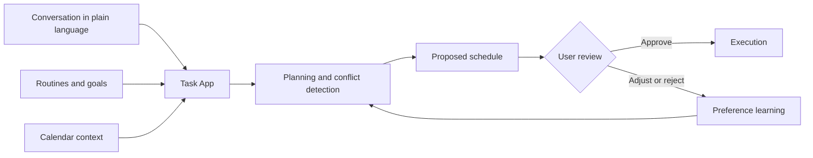

# Task App

Task App is an evolving personal productivity agent designed to reduce the effort required to organize everyday life and turn goals into action.

The primary way to use it is conversational: you describe what you want in plain language, and the agent turns that into the same tasks, routines, goals, and schedule changes the rest of the product works with - no forms or settings screens required for everyday use. Instead of asking people to constantly maintain a perfect plan, the product brings together tasks, routines, goals, and calendar context. The agent proposes schedules, detects conflicts, and adapts over time from approvals and feedback. The user stays in control of every meaningful change.

> Task App is currently in active alpha development. This repository is a public product overview; the implementation and operational documentation are private.

## Demo

https://github.com/user-attachments/assets/caa1b5c8-e3a0-48e4-a2ea-8d8f0e54da64

## Product direction

- **Talk to it, don't configure it:** the main way to add, adjust, or ask about anything is a conversation in plain language.
- **Bring everything together:** tasks, routines, goals, constraints, and calendar context share one planning model.
- **Let the agent handle the plan:** the system turns intentions into realistic suggestions and replans when circumstances change.
- **Stay in control:** users approve changes, understand why they were suggested, and teach the agent through feedback.

## How it fits together

The architecture shown here is intentionally product-level. It explains the responsibility of each part without exposing private infrastructure or account configuration.

## Public documentation

- [Product vision](VISION.md)
- [Public roadmap](ROADMAP.md)

Screenshots and demonstrations published here will use fictional data. The public overview is curated manually so that personal information and operational details cannot be copied accidentally.

## Project status

The foundations for task management, routines, calendar-aware planning, Advisor suggestions, and feedback are being developed iteratively. Current work is focused on making the conversational interface handle everyday planning changes reliably on its own - without falling back to a slower general-purpose exchange - and on keeping the scheduler's reasoning explainable when a conflict or a rejected change needs a plain-language answer.
