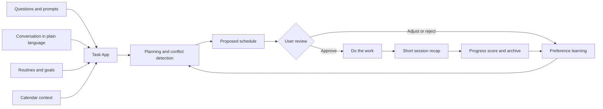

# Task App

Task App is a personal productivity agent built for a problem most planners ignore: people stop opening the app.

Goals become overwhelming because it is hard to know how much effort to put in, whether you are on track, or how to adjust when life changes. Most tools are fire-and-forget — you fill them in once, then the system waits for you to remember it exists.

Task App is meant to work more like a chief of staff. You talk to it in plain language. It pulls calendar context, asks concrete questions instead of expecting a complete setup, proposes a realistic plan, and reorganizes when you miss something or the week shifts. After a working session it can ask what you actually did. Over time it keeps a progress score and an archive of sessions.

The user stays in control of every meaningful change.

> Task App is currently in active alpha development. This repository is a public product overview; the implementation and operational documentation are private.

## Demo

https://github.com/user-attachments/assets/caa1b5c8-e3a0-48e4-a2ea-8d8f0e54da64

## Product direction

- **Ask, don't wait:** it is easier to answer a prompt than to remember a system. Questions like "what is this project for?" and "how long will this take?" are core, not extras.
- **Talk to it, don't configure it:** add, adjust, or ask about anything in plain language.
- **Bring everything together:** tasks, routines, goals, constraints, and calendar context share one planning model.
- **Pull the user back in:** the product should notice drift, warn about important work, and make showing up feel lighter than maintaining a plan by hand.
- **Stay in control:** users approve changes, understand why they were suggested, and teach the agent through feedback.

## How it fits together

```mermaid
flowchart LR
    Q[Questions and prompts] --> A[Task App]
    U[Conversation in plain language] --> A
    R[Routines and goals] --> A
    C[Calendar context] --> A
    A --> P[Planning and conflict detection]
    P --> S[Proposed schedule]
    S --> F{User review}
    F -->|Approve| E[Do the work]
    E --> Recap[Short session recap]
    Recap --> Score[Progress score and archive]
    F -->|Adjust or reject| L[Preference learning]
    Score --> L
    L --> P
```

The architecture shown here is intentionally product-level. It explains the responsibility of each part without exposing private infrastructure or account configuration.

## Public documentation

- [Product vision](VISION.md)
- [Public roadmap](ROADMAP.md)

Screenshots and demonstrations published here will use fictional data. The public overview is curated manually so that personal information and operational details cannot be copied accidentally.

## Project status

The foundations for task management, routines, calendar-aware planning, Advisor suggestions, and feedback are being developed iteratively. Current work is focused on making the conversational interface handle everyday planning changes reliably, asking the right questions at the right time, and keeping the scheduler's reasoning explainable when a conflict or a rejected change needs a plain-language answer.
