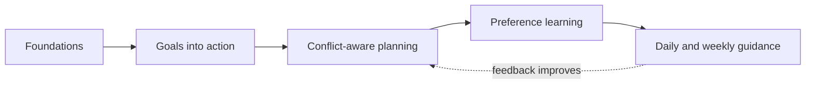

# Public Roadmap

This roadmap communicates product direction rather than fixed delivery dates. Priorities may change as the planning model is tested and user feedback reveals better paths.

## 1. Reliable foundations

Build a dependable base for tasks, routines, calendar context, and reviewable Advisor suggestions.

- consistent task and routine workflows;
- clear proposal, approval, rejection, and undo states;
- useful activity history and operational visibility;
- privacy controls for personal planning data.

## 2. Goals into action

Allow users to define outcomes without manually inventing every intermediate task.

- goal creation and progress tracking;
- agent-proposed milestones and next actions;
- links between goals, tasks, and routines;
- review before generated work enters the active plan.

## 3. Conflict-aware planning

Move from isolated suggestions to a coherent plan across all responsibilities.

- detect deadline, dependency, calendar, and capacity conflicts;
- explain why a plan is not feasible;
- present useful resolution options;
- replan when tasks or constraints change;
- distinguish hard constraints from adaptable preferences.

## 4. Preference learning and control

Learn from behavior without creating invisible or permanent rules.

- infer preferences from several kinds of feedback;
- show which observation produced a learned rule;
- let users review, edit, merge, pause, and remove rules;
- apply confidence and scope so weak evidence cannot dominate planning.

## 5. Daily and weekly guidance

Turn the complete plan into a focused, low-effort working experience.

- concise daily focus and realistic next actions;
- weekly review of progress, missed work, and upcoming pressure;
- proactive warnings before conflicts become urgent;
- transparent adaptation when the plan changes.

## Outside the public roadmap

Security incidents, infrastructure changes, account configuration, migrations, internal issue details, and exact release plans remain in the private implementation repository.
