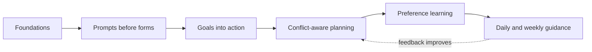

# Public Roadmap

This roadmap communicates product direction rather than fixed delivery dates. Priorities may change as the planning model is tested and user feedback reveals better paths.

## 1. Reliable foundations

Build a dependable base for tasks, routines, calendar context, and reviewable Advisor suggestions.

- consistent task and routine workflows;
- clear proposal, approval, rejection, and undo states;
- useful activity history and operational visibility;
- privacy controls for personal planning data.

## 2. Prompts before forms

Make it easier to answer a question than to maintain a system.

- ask for intent and time estimates when a project is thin;
- request a short recap at the end of a work session;
- keep a master archive of sessions;
- avoid fire-and-forget empty states that depend on the user coming back unprompted.

## 3. Goals into action

Allow users to define outcomes without manually inventing every intermediate task.

- goal creation and progress tracking;
- agent-proposed milestones and next actions;
- links between goals, tasks, and routines;
- review before generated work enters the active plan;
- a simple running score of progress that can later support light competition against yourself (hours, streaks, or finished work).

## 4. Conflict-aware planning

Move from isolated suggestions to a coherent plan across all responsibilities.

- scour calendar context on weekly and monthly horizons;
- detect deadline, dependency, calendar, and capacity conflicts;
- explain why a plan is not feasible;
- present useful resolution options;
- replan when tasks or constraints change;
- distinguish hard constraints from adaptable preferences;
- warn before something important arrives.

## 5. Preference learning and control

Learn from behavior without creating invisible or permanent rules.

- infer preferences from approvals, edits, recaps, and skipped prompts;
- show which observation produced a learned rule;
- let users review, edit, merge, pause, and remove rules;
- apply confidence and scope so weak evidence cannot dominate planning.

## 6. Daily and weekly guidance

Turn the complete plan into a focused, low-effort working experience.

- concise daily focus and realistic next actions;
- weekly review of progress, missed work, and upcoming pressure;
- proactive warnings before conflicts become urgent;
- enough variety in prompts and next actions that the system does not go stale;
- transparent adaptation when the plan changes.

```mermaid
flowchart LR
    F[Foundations] --> Q[Prompts before forms]
    Q --> G[Goals into action]
    G --> C[Conflict-aware planning]
    C --> L[Preference learning]
    L --> D[Daily and weekly guidance]
    D -. feedback improves .-> C
```

## Outside the public roadmap

Security incidents, infrastructure changes, account configuration, migrations, internal issue details, and exact release plans remain in the private implementation repository.
