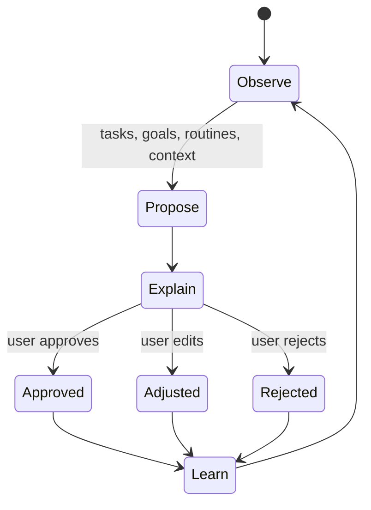

# Product Vision

## North star

Task App should become a personal productivity agent that makes organizing life feel lighter. A user should be able to describe what needs to happen, define recurring responsibilities and meaningful goals, then rely on the app to continuously propose a workable plan.

The desired experience is not a larger to-do list. It is a system that manages the ongoing reasoning between intentions, time, constraints, and changing circumstances.

## Inputs

The planning model brings together:

- one-off tasks and their deadlines;
- recurring routines and periodic constraints;
- goals that can generate concrete next actions;
- existing calendar commitments;
- user preferences, availability, and feedback;
- dependencies, priorities, and conflicts between activities.

## Agent responsibilities

The agent should:

1. Turn goals and unstructured intentions into actionable proposals.
2. Find realistic time for tasks and routines.
3. Detect impossible or conflicting plans before they surprise the user.
4. Replan when new tasks arrive, constraints change, or work is not completed.
5. Explain its proposals and the trade-offs behind them.
6. Learn carefully from approvals, adjustments, and rejections.

## Control and trust

Automation must remain approval-based. The agent may do the organizational work, but the user decides what becomes part of the plan.

Trust depends on understandable suggestions, reversible actions, visible uncertainty, and feedback that has a clear effect. Learned preferences must be reviewable and removable.

## Product principles

- **Less organizational effort:** every feature should reduce planning work rather than create another maintenance obligation.
- **Global coherence:** a locally sensible suggestion must also fit the wider plan.
- **Conflict awareness:** deadlines, dependencies, routines, and calendar events must be considered together.
- **Explainability:** important suggestions should include concise reasons and identify blocked alternatives.
- **Progressive autonomy:** automation grows only as the system earns confidence and the user grants it.
- **Privacy by design:** personal planning data and learned behavior are sensitive by default.

## What success looks like

Task App succeeds when a user can focus on deciding what matters and doing the work, while the app handles most of the ongoing scheduling, conflict detection, and replanning. The plan remains realistic, the reasoning remains visible, and the user can correct the system without rebuilding everything manually.
