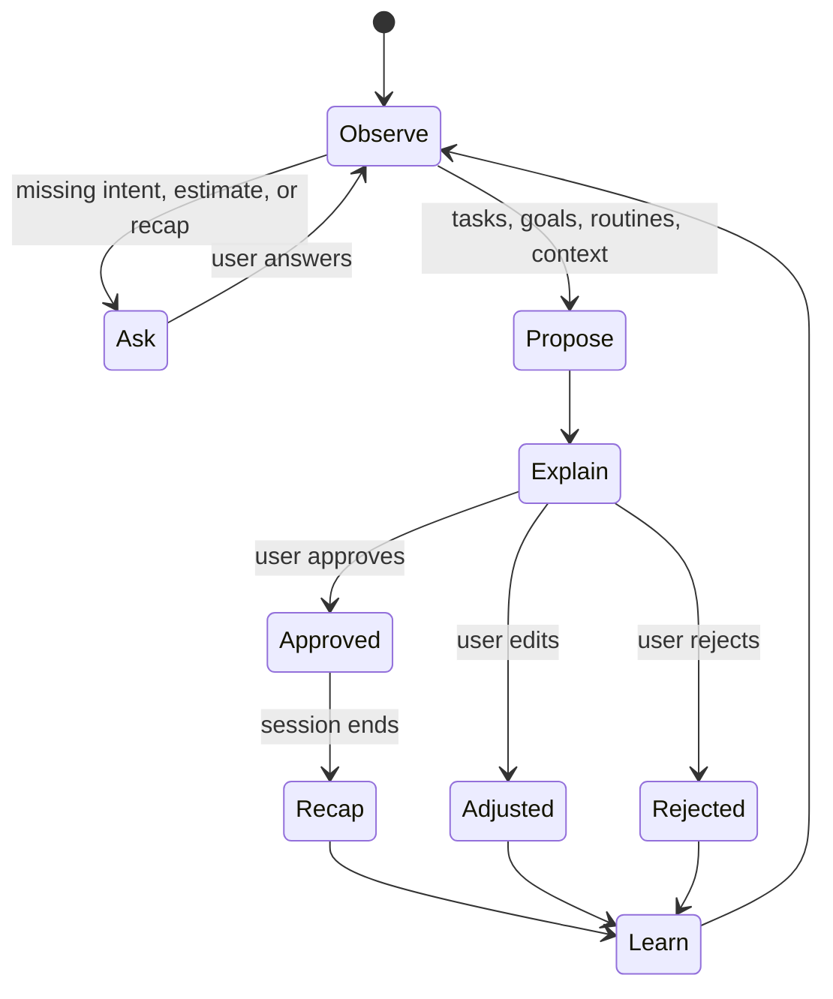

# Product Vision

## North star

Task App should feel like a chief of staff for personal work: it notices what is coming, asks the questions you would forget to answer, and keeps a realistic plan alive when attention slips.

The desired experience is not a larger to-do list and not a calendar you have to remember to check. It is a system that manages the ongoing reasoning between intentions, time, constraints, and changing circumstances — and that pulls you back in with prompts instead of waiting for perfect consistency.

People who struggle most with planners often do not fail at wanting structure. They fail at showing up to the structure. Novelty, a visible sense of progress, and a small element of challenge help. The product should make responding easier than remembering.

## Inputs

The planning model brings together:

- one-off tasks and their deadlines;
- recurring routines and periodic constraints;
- goals that can generate concrete next actions;
- existing calendar commitments, scanned on a weekly and monthly horizon;
- short answers to prompts (intent, time estimate, what actually happened);
- user preferences, availability, and feedback;
- dependencies, priorities, and conflicts between activities.

## Agent responsibilities

The agent should:

1. Ask focused questions instead of requiring a complete setup up front.
2. Turn goals and unstructured intentions into actionable proposals.
3. Find realistic time for tasks and routines, and warn when something important is approaching.
4. Detect impossible or conflicting plans before they surprise the user.
5. Replan when new tasks arrive, constraints change, or work is not completed. The user chooses how: keep what is already confirmed and only fit the new items around it, or rebuild the whole plan.
6. Elicit a short recap after a work session and keep an archive of sessions.
7. Keep a running, optionally competitive, score of progress — without turning the product into a noisy game.
8. Explain its proposals and the trade-offs behind them.
9. Learn carefully from approvals, adjustments, rejections, and recaps.
10. Match the plan to what the person can actually do. When work keeps slipping, propose a lighter plan and build back up from there, instead of proposing the same load again. Missing is information, not failure.

## Control and trust

Automation must remain approval-based. The agent may do the organizational work, but the user decides what becomes part of the plan.

```mermaid
stateDiagram-v2
    [*] --> Observe
    Observe --> Ask: missing intent, estimate, or recap
    Ask --> Observe: user answers
    Observe --> Propose: tasks, goals, routines, context
    Propose --> Explain
    Explain --> Approved: user approves
    Explain --> Adjusted: user edits
    Explain --> Rejected: user rejects
    Approved --> Recap: session ends
    Recap --> Learn
    Adjusted --> Learn
    Rejected --> Learn
    Learn --> Observe
```

Trust depends on understandable suggestions, reversible actions, visible uncertainty, and feedback that has a clear effect. Learned preferences must be reviewable and removable. Prompts should be few and useful, never a second inbox.

## Product principles

- **Less organizational effort:** every feature should reduce planning work rather than create another maintenance obligation.
- **Responding beats remembering:** a good question at the right moment beats a perfect empty system.
- **Show up without the app becoming the job:** consistency is the hard part; the product has to help people return.
- **Global coherence:** a locally sensible suggestion must also fit the wider plan.
- **Conflict awareness:** deadlines, dependencies, routines, and calendar events must be considered together.
- **Explainability:** important suggestions should include concise reasons and identify blocked alternatives.
- **Progressive autonomy:** automation grows only as the system earns confidence and the user grants it.
- **Privacy by design:** personal planning data and learned behavior are sensitive by default.

## Two directions of interaction

- **The user talks to the app.** Through the chat, the user defines goals, routines, and events, confirms the proposed schedule, and later adds new ideas and commitments that trigger a replan.
- **The app reaches out to the user.** It brings the plan to the user, nudges at the right moment, and keeps momentum with light incentives such as streaks, so the plan does not depend on remembering to open the app.

## Later: community

Once the core loop works for individuals, the product may grow a social layer: people sharing goals and progress, and finding others who struggle with the same things. This is a long-term direction, not part of the current roadmap, and it must respect the privacy principle above: nothing is shared unless the user chooses to share it.

## What success looks like

Task App succeeds when a user can focus on deciding what matters and doing the work, while the app handles most of the ongoing scheduling, conflict detection, and replanning. The plan remains realistic, the reasoning remains visible, and the user can correct the system without rebuilding everything manually.

It also succeeds if people who usually abandon planners still answer a prompt, finish a session, and can see progress without having filled out a perfect system first.
